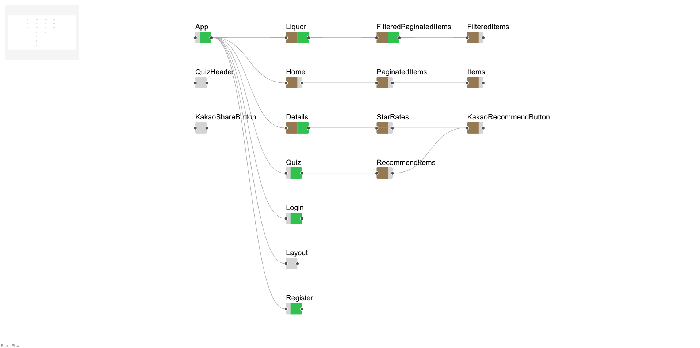

# HookLens 실험
본 실험은 **React** 어플리케이션 개발 과정에서 발생하는 **Chanlleges**를 해결하기 위한 시각화 도구인 **HookLens**의 효과를 검증하기 것을 목표로 함

## 📌 실험 개요

### Challenges
1. **State Management** : **Prop Drilling** 패턴으로 인한 데이터 전달 비효율성
    - Prop Drilling :  부모 컴포넌트가 하위 자식 컴포넌트에 데이터를 전달하기 위해 불필요한 props를 중간 컴포넌트로 전달하는 패턴을 말함
2. **Dependency Management for useEffect**: Dependency Array의 변수 추적 및 관리 어려움

### Experiment Environment
- Base : VSCode + React Dev Tool
- Test : VSCode + React Dev Tool + HookLens

#### Base Environment
```
git clone https://github.com/Suyeon-Stom-Hwang/HookLens.git
```

- /HookLens/sample/project 내에 실험용 프로젝트가 있습니다.

#### Test Environment
```
// Project Clone
cd HookLens
yarn install
yarn start
```


1. ***Select Files***를 클릭하고 project 폴더를 선택하세요.
2. ***Go to Visualization*** 버튼이 활성화되면 클릭하세요.

3. ***Node***를 클릭하면 해당 Component의 상세 정보를 확인할 수 있습니다.

### Example Project Structure
```
project
├── README.md
├── src
│   ├── Page
│   │   ├── Details.js
│   │   ├── Home.js
│   │   ├── Layout.js
│   │   ├── Liquor.js
│   │   ├── Login.js
│   │   └── Quiz.js
│   │   └── Register.js
│   └── Styles
│   │   ├── ...
│   └── Store
│   │   ├── ...
│   └── Component
│   │   ├── ...
│   └── Entity
│   │   ├── ...
│   └── Api
│   │   ├── ...
│   └── Asset
│   │   ├── ...
├── App.js
├── index.js
└── package.json
```

### Task 1. Identifying Prop Drilling

#### 1️⃣ **Task 정의**  
- 부모 컴포넌트에서 자식 컴포넌트가 사용하지 않는 불필요한 props를 포함하여 전달하는 경우
- props가 필요한 자식 컴포넌트가 있더라도 중간 계층 컴포넌트에서 props를 내려보내기만 하고, 해당 데이터를 직접적으로 사용하지 않는 경우도 해당

#### 2️⃣ **측정 항목**
- 제한된 시간(10분) 내에 찾은 해당 props의 개수

#### 3️⃣ **예시**

```jsx
// Parent Component
const Parent = () => {
    const prop1 = 'prop1';
    const prop2 = 'prop2';
    const prop3 = 'prop3';

    return <Child1 prop1={prop1} prop2={prop2} prop3={prop3} />;
}

// Child1 Component
const Child1 = ({ prop1, prop2, prop3 }) => {

    const handleClick = () => {
        console.log(prop1);
    }

    return <Child2 prop2={prop2} prop3={prop3}
    onClick={handleClick} />;
    />;
}

// Child2 Component
const Child2 = ({ prop2, prop3 }) => {
    return <Child3 prop2={prop2} />;
}

// Child3 Component
const Child3 = ({ prop2 }) => {
    return <div>{prop2}</div>;
}
```
- **문제**
    - 위의 코드에서 prop1, prop2, prop3가 Prop Drilling에 해당하는지 판단

- **정답**
    - `prop1`
        - No
    - `prop2`
        - Yes
    - `prop3`
        - Yes

- **Prop Drilling**
     - `prop2`
        - 3번 (Parent → Child1 → Child2 → Child3)
        - Child3 컴포넌트에서 사용
     - `prop3`
        - 2번 (Parent → Child1 -> Child2)
        - 사용되지 않음


### 📝 ***Problem***
- 제시된 환경에서 주어진 state가 Prop Drilling 패턴으로 전달되는 경우인지 판단하세요.

1. ***Base***
- App.js 내의 `pageCount`,`filteredItemsId`, `currentAlcoholList`, `dummyAlcoholList` state가 Prop Drilling 패턴으로 전달되는지 판단하고 걸린 시간을 측정하세요.

2. ***Test***
- App.js 내의 `category`,`itemOffset`, `setFilteredAlcoholList`, `filteredItemOffset` state가 Prop Drilling 패턴으로 전달되는지 판단하고 걸린 시간을 하세요.

### Task 2. Identifying Components Affected by State-Triggered *useEffect()*

#### 1️⃣ **Task 정의**  
- 특정 state가 변경되었을 때, 해당 state를 dependencies로 가지고 있는 useEffect()가 실행되어 다른 state를 변경하는 setter가 실행되는 경우
- 변경된 state가 props 형태로 자식 Component에 전달되어 연쇄적으로 영향을 주는 경우도 포함

#### 2️⃣ **측정 항목**
- 특정 Component 내에서 선언된 state 혹은 전달받은 props를 하나 지정
- 해당 state의 변경으로 인해 re-render되는 Component를 모두 찾는 시간 측정 및 비교

#### 3️⃣ **예시**

```jsx
const ComponentA = () => {
  const [stateA, setStateA] = useState(0);
  const [stateB, setStateB] = useState(0);

  useEffect(() => {
    console.log("useEffect triggered by stateA");
    setStateB((prev) => prev + 1); // stateB 변경
  }, [stateA]);

  return (
    <div>
      <button onClick={() => setStateA(stateA + 1)}>Update State A</button>
      <p>State A: {stateA}</p>
      <p>State B: {stateB}</p>
    </div>
  );
};

const ComponentB = ({ stateB }) => {
  useEffect(() => {
    console.log("useEffect triggered by stateB");
  }, [stateB]);

  return <p>State B in ComponentB: {stateB}</p>;
};

const App = () => {
  const [stateB, setStateB] = useState(0);

  return (
    <div>
      <ComponentA />
      <ComponentB stateB={stateB} />
    </div>
  );
};
```
- **문제**
    - `ComponentA`에서 `stateA`가 변경

- **정답**
    - `ComponentA`, `ComponentB`

- **순서**
    - `ComponentA`에서 `stateA`가 변경되어 *useEffect()* 실행
    - `ComponentA`의 *useEffect()* 내에서 `stateB` 변경
    - `ComponentB`에서 `stateB` 변경 감지 후 *useEffect()* 실행

### 📝 ***Problem***
- Liquor.js의 `filteredItemsId` state가 변경되었을 때 영향을 받는 Component를 모두 찾고 시간을 측정하세요.
- Base와 Test 환경에서 각각 한 번씩 진행해주세요.


### 📝 ***Problem***
- 제시된 환경에서 주어진 state가 변경되었을 때 영향을 받는 Component를 모두 찾고 시간을 측정하세요.

1. ***Base***
- Liquor.js의 `filteredItemsId` state가 변경되었을 때

2. ***Test***
- PaginatedItems.js의 `itemOffset` state가 변경되었을 때